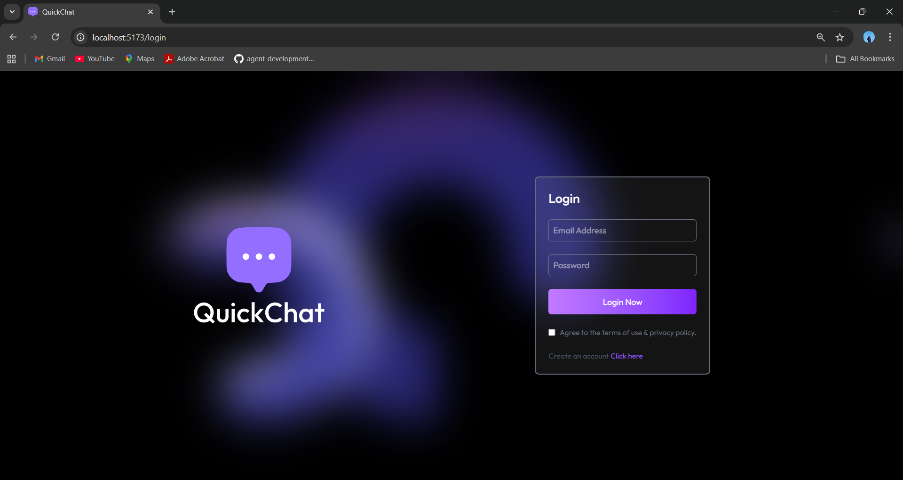
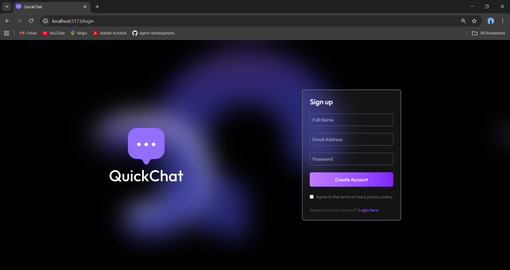
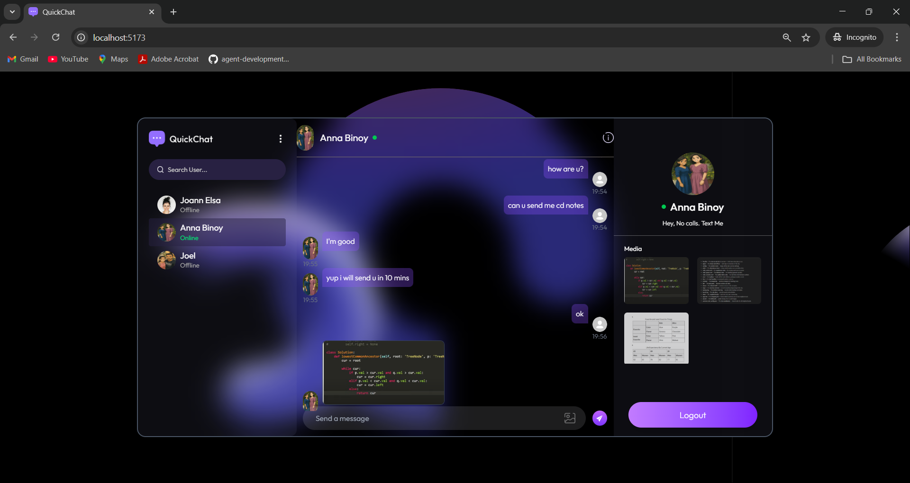
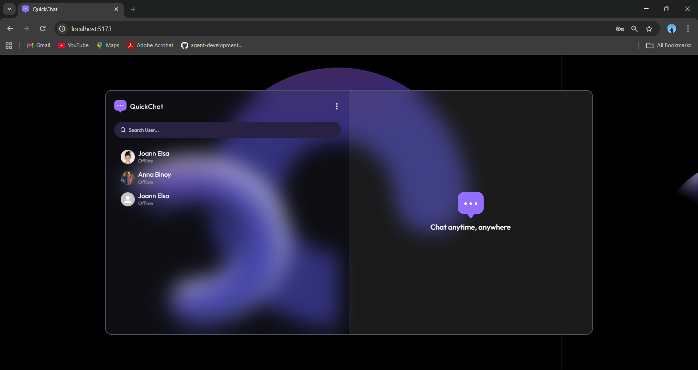
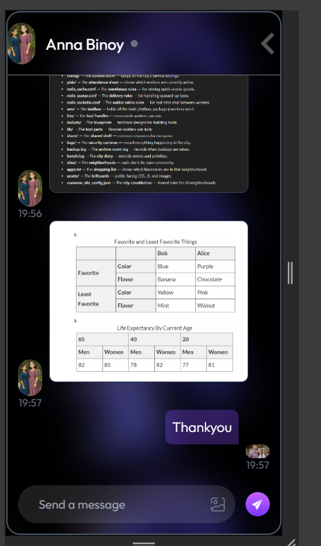
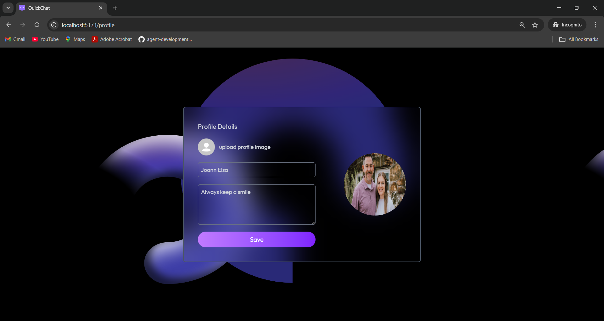

## QuikChat

Modern real-time chat app with authentication, profiles, image messages, and online presence.

### Features
- **Auth**: Sign up, log in, JWT-protected routes
- **Real-time chat**: Socket.IO messaging, seen/unseen tracking
- **Profiles**: Update name, bio, and profile photo (Cloudinary)
- **Online users**: Presence broadcast to all clients

### Tech Stack
- **Client**: React + Vite, React Router, TailwindCSS, Socket.IO Client
- **Server**: Node.js, Express, Socket.IO, MongoDB/Mongoose, JWT, Bcrypt, Cloudinary

---

### Quick Start
1) Server
```bash
cd server
npm install
# Create .env (see below)
npm run server   # hot-reload with nodemon
# or: npm start  # plain Node
```

2) Client
```bash
cd client
npm install
npm run dev
```

By default the API listens on `http://localhost:5000` and Vite serves the client on `http://localhost:5173`.

---

### Environment Variables (server/.env)
```ini
# Server
PORT=5000

# MongoDB (IMPORTANT: use the base connection string without a database name)
# The app automatically appends "/chat-app" in code.
MONGODB_URI=mongodb+srv://<user>:<password>@<cluster-host>

# Auth
JWT_SECRET=replace_me_with_a_long_random_string

# Cloudinary (for profile images and message images)
CLOUDINARY_CLOUD_NAME=your_cloud_name
CLOUDINARY_API_KEY=your_api_key
CLOUDINARY_API_SECRET=your_api_secret
```

---

### API Overview
Base URL: `http://localhost:5000`

- `GET /api/status` → health check

Auth (`/api/auth`)
- `POST /api/auth/signup` → `{ fullName, email, password, bio }`
- `POST /api/auth/login` → `{ email, password }`
- `PUT /api/auth/update-profile` (protected) → `{ fullName, bio, profilePic?base64 }`
- `GET /api/auth/check` (protected)

Messages (`/api/messages`) – all protected with header `token: <JWT>`
- `GET /api/messages/users` → list users (excludes self) + unseen counts
- `GET /api/messages/:id` → full conversation with user `:id` (marks incoming as seen)
- `PUT /api/messages/mark/:id` → mark a specific message as seen
- `POST /api/messages/send/:id` → send `{ text?, image?base64 }` to user `:id`

WebSockets (Socket.IO)
- Server origin is open for dev (`cors: { origin: "*" }`).
- Client connects with query `userId` for presence mapping.

Header for protected REST requests:
```
token: <your_jwt>
```

---

### Project Structure
```
QuikChat/
  client/           # React app (Vite)
  server/           # Express + Socket.IO + MongoDB API
  README.md
```

---

### Screenshots
Create a `docs/screenshots/` folder at the project root and drop your images there. Then replace the placeholders below with your actual filenames.

- **Login / Signup**



- **Chat (Desktop)**



- **Chat (Mobile)**


- **Profile**



---

### Notes
- Ensure your `MONGODB_URI` does NOT include a database name; the code appends `/chat-app` when connecting.
- For production, restrict Socket.IO CORS and configure secure secrets.
- Cloudinary is optional for images; if you disable it, adjust the profile/message image flows.


